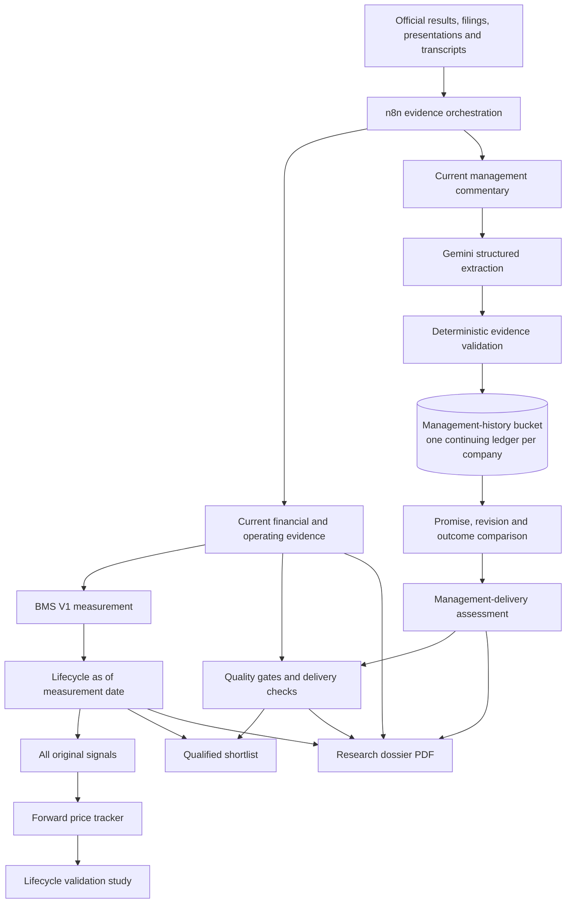

# AlphaSynth Intelligence — Master Project Reference

**Reference date:** 11 September 2026  
**Repository:** `srscoll-lab/alphasynth-equity`  
**Working branch:** `codex/server-dossier-pdf`  
**Product stage:** controlled pilot; the original production signal remains protected

## 1. Executive summary

AlphaSynth Intelligence is an Indian-equity research application designed to identify **changes in business momentum before they become obvious from a conventional stock screener**. Its primary differentiator is not another collection of valuation ratios. It is a structured, evidence-linked view of:

1. the direction of a company's underlying business momentum;
2. the lifecycle stage of that momentum;
3. whether the evidence is sufficiently complete and reliable;
4. whether management has historically delivered what it said; and
5. whether subsequent share-price behaviour supports or challenges the original signal.

The application deliberately separates these questions. The original BMS V1 signal is retained as an auditable point-in-time measurement. New quality and management-delivery checks qualify the signal rather than silently rewriting it.

The intended product proposition is:

> **Find a change in the business, understand why the signal appeared, test whether management is credible, and then observe whether the market eventually recognises the change.**

AlphaSynth is a research-prioritisation system, not a buy/sell recommendation engine.

## 2. Why the product changed direction

Early research dossiers attempted to reproduce widely available information such as P/E, EPS, price-to-book, ROE, ROCE and peer tables. That approach created three problems:

- much of the content was already available from established financial websites;
- issuer-by-issuer source formats caused incomplete tables and charts;
- a visually rich PDF could still add little proprietary value.

The project was therefore refocused on the parts that are distinctive and defensible:

- the BMS methodology;
- the five-factor measurement bridge;
- expectations versus actual delivery;
- hard and soft quality gates;
- management guidance, revisions and delivery history;
- lifecycle-qualified shortlisting; and
- prospective price tracking of previously recorded signals.

Conventional financial tables can still provide evidence, but they are supporting inputs rather than the product's central value proposition.

## 3. Revised product mind map



### The governing principle

The system has three logically separate layers:

| Layer | Question answered | Can it change the original BMS V1 record? |
|---|---|---:|
| BMS V1 | What is happening to business momentum? | No — it is a dated historical measurement |
| Qualification overlay | Is the signal supported by sufficient quality and delivery evidence? | No — it adds qualification status |
| Forward validation | Did later market behaviour support the lifecycle thesis? | No — it evaluates the model prospectively |

## 4. BMS V1 — the core signal

### Purpose

The Business Momentum Score measures **change in company fundamentals**, not absolute company quality, valuation attractiveness or expected share-price return.

### Five factors

| Factor | Weight | Primary question |
|---|---:|---|
| Earnings | 25% | Are reported earnings, margins and profitability accelerating or weakening? |
| Economics | 25% | Are demand, pricing, mix, input costs, capacity conditions and industry economics improving or deteriorating? |
| Execution | 25% | Is management converting plans into measurable operating outputs such as volumes, utilisation, launches or milestones? |
| Balance sheet | 15% | Is growth supported by financial resilience rather than excessive leverage, working-capital strain or weak cash conversion? |
| Management delivery | 10% | Is management delivering against previously stated commitments? |

### Lifecycle presentation

The current user-facing stages are:

- **Watch:** evidence is worth monitoring, but confirmation is incomplete;
- **Emerging:** a meaningful positive fundamental inflection has appeared;
- **Sustained / Established:** positive momentum has persisted beyond the initial inflection; and
- **Fading:** previously meaningful momentum has deteriorated materially.

The precise historical BMS record must retain its score, evidence date, factor weights and lifecycle as they existed at the measurement date. In user-facing language, this should be described as **“BMS V1 as of [date]”** rather than repeatedly emphasising the word “frozen.” In technical change control, BMS V1 remains frozen: a formula or threshold change requires a separately labelled BMS V2 proposal.

### Explainability contract

Where evidence exists, every factor report should contain:

- previous and current periods;
- previous and current measurements;
- the underlying metrics and units;
- the factor-score change;
- the weighted contribution;
- a concise evidence-bound explanation;
- dated evidence references; and
- an availability and confidence label.

Missing observations are `null` or **unavailable**, never zero. A factor score and confidence label describe different things: a high score can coexist with medium confidence when the observed direction is strong but the supporting evidence is incomplete. The interface and PDF must explain this distinction clearly.

The detailed contracts are maintained in [BMS_V1_SPECIFICATION.md](BMS_V1_SPECIFICATION.md) and [BMS_FACTOR_REPORT_SCHEMA.md](BMS_FACTOR_REPORT_SCHEMA.md).

## 5. Expectations–delivery qualification overlay

### Purpose

The overlay helps distinguish an interesting lifecycle signal from a signal that is sufficiently evidenced to merit higher research priority. It does not delete a company or change its historical BMS classification.

### Sequence

1. Preserve BMS V1 and its dated lifecycle.
2. Apply hard and soft quality gates using dated evidence.
3. Record the applicable expectation or prior baseline.
4. Record the later reported outcome.
5. Calculate delivery direction deterministically;
6. add management-delivery history when it is sufficiently mature; and
7. assign a qualification status for the shortlist and dossier.

### Initial hard-gate families

A failed hard gate excludes a company from the qualified shortlist without removing it from **All signals**. An unknown hard gate produces `insufficient_evidence`, not a pass.

- cash conversion;
- leverage and interest coverage;
- promoter pledge;
- auditor integrity; and
- material governance events.

### Initial soft-warning families

- receivables or inventory deterioration;
- customer or business concentration;
- deterioration in incremental return on capital;
- excessive acquisition dependence; and
- management-delivery history.

Soft warnings do not automatically reject a signal, but they require caution and should remain visible.

### Delivery calculations

The current reconstructed bridge can use comparable quarter history for metrics such as:

- revenue growth versus the prior year-on-year baseline; and
- EBITDA margin versus the prior-quarter baseline.

At least 60% of configured metric weight is required for a complete delivery classification. Missing metrics remain unknown. Historical assessments produced after the event must be labelled `reconstructed_today`; only evidence and expectations recorded before the outcome can be labelled `prospective`.

The overlay is described in detail in [EXPECTATIONS_DELIVERY_V1.md](EXPECTATIONS_DELIVERY_V1.md).

## 6. Management commentary and delivery history

### Why a history layer is necessary

A current transcript can reveal what management is saying today, but it cannot by itself answer whether management has been reliable. Reliability requires a time series:

1. what was promised;
2. whether the wording or target changed;
3. whether the change was explained promptly;
4. when the commitment matured; and
5. what was eventually delivered.

Without persistent history, each quarterly analysis would forget the previous call and could not judge delivery fairly.

### What “management-history bucket” means

The bucket is a private Google Cloud Storage location used as the application's long-term memory. It is not a new user screen and it does not calculate a score. It stores one versioned JSON ledger per company, under a path such as:

```text
management-guidance-ledger/v1/RELIANCE.json
management-guidance-ledger/v1/TITAN.json
management-guidance-ledger/v1/BAJAJ-AUTO.json
```

Each ledger contains three related record types.

#### A. Commitment statements

- stable commitment key;
- exact management statement;
- statement date;
- target or maturity date;
- metric concerned;
- specificity, measurability and deadline clarity; and
- evidence references.

Repeated statements of the same economic promise retain the same commitment key. This prevents repeated guidance from being counted as multiple promises.

#### B. Commentary observations

The system compares a current statement with its prior version and records whether it was:

- new;
- maintained;
- raised;
- lowered;
- postponed;
- withdrawn;
- contradicted; or
- unclear.

It can also record revision timeliness, explanation quality and internal consistency when those dimensions are supported by evidence.

#### C. Delivery observations

After a target matures, its outcome may be recorded as:

- delivered;
- partially delivered;
- missed;
- pending; or
- unverifiable.

Silence is not automatically treated as a miss. Pending commitments receive no outcome points. Unsupported outcomes do not score.

### Management-delivery assessment

The current deterministic weighting is:

| Component | Weight | Interpretation |
|---|---:|---|
| Matured delivery | 70% | What proportion of measurable matured commitments was delivered? |
| Revision discipline | 20% | Were revisions timely, explained and internally consistent? |
| Disclosure quality | 10% | Were commitments specific, measurable and time-bound? |

At least **three matured, verifiable commitments** are required before presenting a substantive management-delivery score. Otherwise the correct result is `insufficient_history`.

The resulting bands are:

- `strong_delivery` — score of at least 80;
- `generally_consistent` — score of at least 65;
- `mixed_delivery` — score of at least 40;
- `weak_delivery` — score below 40; or
- `insufficient_history` — no defensible score yet.

### Division of responsibility

| Component | Responsibility |
|---|---|
| Gemini | Extract structured candidate commitments, revisions and outcomes from cited text |
| Deterministic validation | Reject unsupported, malformed, future-dated or contradictory records |
| GCS history bucket | Retain the accepted company history across runs |
| Deterministic scorer | Calculate delivery, revision and disclosure components |
| n8n | Coordinate calls and preserve unavailable states |
| UI and PDF | Explain the result and its effect on qualification |

Gemini is the reader, not the judge. It cannot assign the final management score, override a gate or manufacture a missing observation.

### Ledger integrity controls

The storage layer is intentionally conservative:

- historical rows are immutable once stored under an ID;
- conflicting content under the same ID is rejected;
- evidence references can be added without rewriting the historical claim;
- concurrent updates use GCS generation matching and retry safely;
- malformed symbols, dates and schemas are rejected;
- post-cutoff evidence is not allowed into an as-of assessment; and
- storage failure produces `unavailable`, not an inferred score.

The Cloud Run service accesses the bucket through its service account. No credentials file is stored in the repository.

## 7. Evidence and research-dossier pipeline

### Source hierarchy

The preferred evidence is dated, official and attributable:

1. exchange or regulator filings;
2. company financial results;
3. investor presentations;
4. earnings-call transcripts;
5. annual reports and formal notices; and
6. clearly labelled supplemental financial tables when official structured history is unavailable.

Supplemental data, such as reconstructed quarterly tables sourced from Screener, must be labelled as supplemental and subject to verification against exchange filings. It may help populate a reconstructed analytical bridge, but it must never be represented as point-in-time analyst consensus.

### Admission policy

The dossier collector:

- resolves official company domains from a reviewed registry;
- discovers a bounded set of relevant documents;
- follows official PDF links from investor-relations pages;
- admits exact publication dates from valid metadata, filenames, cover letters, title pages or clearly tied index labels;
- rejects undated, unofficial, post-cutoff and lookalike-domain material;
- returns per-URL diagnostics when no source passes; and
- maintains human-review status during the pilot.

Firecrawl is used where available for web extraction. A bounded local PDF-text fallback is used when Firecrawl encounters proxy or tunnel failures and the official PDF itself is directly downloadable. The fallback does not weaken domain, date or cutoff rules.

### Dossier readiness gate

The user should not be offered a polished but substantially empty PDF. The application now blocks dossier download when the available evidence cannot populate a meaningful report. The interface should instead explain which evidence is missing.

This is a product-quality rule, not merely a technical error handler.

### PDF design direction

The six-page target remains a useful discipline, but completeness and readability take priority over filling every page. The final report should concentrate on:

- company and signal snapshot;
- BMS V1 lifecycle and five-factor explanation;
- previous-versus-current measurement bridge;
- expectations and delivery check;
- management commentary, guidance revisions and delivery history;
- quality-gate effect on shortlist qualification;
- forward price movement and validation context; and
- concise source notes and disclaimers.

Peer-ratio tables and generic screeners are no longer central. Sources should be consolidated into a readable source section rather than appended to every sentence. Public-market or social commentary, if retained, must be clearly labelled, anonymised where appropriate, separately sourced, and structurally prohibited from changing BMS.

## 8. Signal Tracker and forward validation

The tracker has two views:

- **All signals:** preserves every original BMS lifecycle result; and
- **Qualified shortlist:** shows signals that have sufficient supporting evidence and have not failed the applicable hard gates.

Qualification states include:

- `qualified`;
- `qualified_with_caution`;
- `not_qualified`; and
- `insufficient_evidence`.

Forward price tracking is a validation tool. It records price behaviour after the lifecycle measurement date so that Emerging, Sustained, Watch and Fading classifications can be evaluated prospectively. Later share prices do not retroactively alter the historical signal.

The lifecycle study must distinguish absolute returns from benchmark-relative returns and must not claim predictive power until sample sizes and observation windows are adequate.

## 9. End-to-end system architecture

| Layer | Current technology | Role |
|---|---|---|
| Front end | React 19, TypeScript, Vite, Tailwind, Recharts | App, tracker, research views and charts |
| Application API | Express/TypeScript on Cloud Run | Evidence routes, BMS bridges, PDF generation and deterministic assessments |
| Core signal API | Separate BMS API service | Supplies the existing BMS/lifecycle record |
| Workflow orchestration | n8n on a Google Compute Engine VM | Coordinates dossier and qualification workflows |
| AI extraction | Gemini through Google GenAI/Vertex configuration | Evidence-bound structured extraction and explanation |
| Web/PDF collection | Firecrawl plus bounded local PDF extraction | Retrieves official material while preserving admission rules |
| Durable history | Google Cloud Storage | Management-guidance ledger and signal-tracker objects |
| PDF generation | Server-side PDFKit template | Consistent downloadable research dossiers |
| Email, where enabled | Resend | Application communication |
| Deployment | Docker container on Google Cloud Run | Tagged zero-traffic pilots and controlled production promotion |

### Important internal routes

| Route | Purpose |
|---|---|
| `POST /api/dossier/generate` | Run the full dossier path through the configured n8n webhook |
| `POST /api/dossier/research-evidence` | Build private official evidence for the dossier workflow |
| `POST /api/pipeline/quarterly-performance` | Produce a bounded supplemental quarterly history |
| `POST /api/bms/management-guidance/from-dossier` | Read prior ledger, extract current guidance, validate, merge and assess |
| `POST /api/bms/expectation-delivery/from-dossier` | Build the deterministic qualification overlay from dossier evidence |
| `POST /api/bms/expectation-delivery/assess` | Assess an already structured overlay input |

Private routes require the shared `x-dossier-token`. Tokens are supplied through environment-backed credentials and must not be embedded in exported n8n workflow JSON.

### Key runtime configuration

- `BMS_API_URL`
- `DOSSIER_WEBHOOK_URL`
- `DOSSIER_INTERNAL_TOKEN`
- `DOSSIER_MODEL`
- `FIRECRAWL_API_KEY`
- `MANAGEMENT_GUIDANCE_LEDGER_BUCKET`
- `MANAGEMENT_GUIDANCE_LEDGER_PREFIX`
- `SIGNAL_TRACKER_BUCKET`
- `SIGNAL_TRACKER_OBJECT`
- `BMS_LIFECYCLE_FREEZE_DATE`

## 10. Deployment topology and status

The project uses tagged Cloud Run revisions at **0% ordinary production traffic** for pilot testing. This permits direct testing without replacing the original live app.

Known service URLs include:

- Production service: `https://alphasynth-equity-oqc2y4ogda-uc.a.run.app`
- Dossier pilot tag: `https://dossier-pilot---alphasynth-equity-oqc2y4ogda-uc.a.run.app`
- Expectation pilot tag: `https://expectation-pilot---alphasynth-equity-oqc2y4ogda-uc.a.run.app`
- BMS validation tag: `https://bms-validation---alphasynth-equity-oqc2y4ogda-uc.a.run.app`
- Tracker candidate tag: `https://tracker-candidate---alphasynth-equity-oqc2y4ogda-uc.a.run.app`
- n8n host: `https://34-170-67-37.sslip.io`

The last user-reported production split retained `alphasynth-equity-dossier17` at 100% traffic. Later dossier, tracker and expectation revisions were deployed as tagged zero-traffic candidates. This traffic statement should be rechecked in Google Cloud before any promotion because it is operational state, not a permanent project fact.

### Current code status on 11 September 2026

The branch contains:

- `935d400` — blocks incomplete dossier PDF downloads;
- `ab74115` — adds the management-delivery qualification overlay; and
- `b3af31c` — adds durable management-guidance history.

The durable ledger code is committed and pushed. It was deployed on 11 September 2026 as the zero-traffic candidate revision `alphasynth-equity-expectation20`, using bucket `my-nse-research-app-management-guidance-470912802345` and prefix `management-guidance-ledger/v1`.

An end-to-end RELIANCE persistence test passed:

- the first request returned HTTP 200, admitted seven structured records, saved three unique pending commitments and reported `storage: saved`;
- the second independent request returned HTTP 200, read the existing ledger, admitted no duplicate records and retained exactly three unique commitments; and
- the assessment correctly remained `insufficient_history` because none of the three commitments had matured and revision-discipline evidence was not yet available.

This verifies durable storage, cross-request retrieval and idempotent deduplication.

### Reconstructed management-history validation

On 11 September 2026, an offline `reconstructed_today` TITAN fixture passed the existing deterministic scorer with four matured, officially evidenced commitments. One commitment was delivered and three were missed. The resulting composite was **45.8/100 (`mixed_delivery`, low confidence)**, with a matured-delivery component of only **25/100**. The higher composite reflects separately scored revision discipline and disclosure clarity; the UI must show those components so the composite cannot be mistaken for a strong delivery record.

The fixture is deliberately isolated from the live GCS ledger. It proves that the history scorer can produce a result once the minimum evidence threshold is satisfied; it does not establish universal company coverage or predictive value. Full evidence and the acceptance-test result are recorded in [TITAN_MANAGEMENT_HISTORY_VALIDATION.md](TITAN_MANAGEMENT_HISTORY_VALIDATION.md).

## 11. Verification already implemented

Local verification commands include:

```bash
npm run lint
npm run build
npm run verify:bms-schema
npm run verify:expectation-delivery
npm run verify:management-guidance
npm run verify:dossier-readiness
```

Management-history validation covers:

- delivery and scoring rules;
- ledger schema and immutable merges;
- evidence-bound Gemini extraction;
- repeated commitment deduplication;
- pending versus matured commitments;
- unsupported outcomes;
- contradictory same-date outcomes;
- post-as-of evidence rejection; and
- unavailable storage behaviour.

The synthetic management-validation suite currently contains 8 scenarios and 4 cross-scenario invariants; all 12 checks passed before the durable-ledger commit was pushed.

Cross-company dossier and overlay testing has included RELIANCE, BAJAJ-AUTO, TITAN, SUNPHARMA and MARUTI. Successful HTTP responses prove execution and structural validity, not universal data completeness or investment validity.

## 12. Honest limitations and risks

### Evidence availability

Indian issuers publish documents in inconsistent formats. Some expose machine-readable tables; others provide image-heavy PDFs, unusual viewers, undated indexes or incomplete transcripts. No responsible general solution can guarantee identical data depth for every company.

### Historical reconstruction

Historical backfilling can improve the initial ledger, but it contains hindsight risk. Every reconstructed record must be labelled accordingly. The strongest management-delivery evidence will accumulate prospectively over future quarters.

### Management silence

Management may not issue measurable targets. Vague optimism cannot be converted into a promise merely to create a score. In such cases, `insufficient_history` is an informative result.

### Balance-sheet and execution evidence

Profit-and-loss data is often easier to extract from quarterly tables than cash flow, debt, working capital, utilisation or project-milestone data. Missing structured balance-sheet or execution measures must remain unavailable. The system should improve source coverage, not invent proxy precision.

### AI boundaries

Gemini can misread context, units or commitment identity. Strict schemas, evidence references and deterministic checks reduce this risk but do not eliminate the need for pilot review.

### Predictive claims

The current forward-return sample is limited. AlphaSynth can honestly claim a structured research and validation process. It should not yet claim proven multibagger prediction or statistically established excess returns.

### Social commentary

Forum, newsletter and social commentary may add qualitative context but introduces selection bias, authenticity questions and sentiment noise. It must remain a separately labelled research aid and must never alter the deterministic BMS signal.

## 13. Definition of done — the hard stop for this build

The current application build should be declared complete when the following conditions are satisfied:

1. **BMS integrity:** BMS V1 and its historical lifecycle records remain unchanged and date-labelled.
2. **Explainability:** all five factors show evidence, previous/current measurements or an honest unavailable state.
3. **Quality overlay:** hard gates, soft warnings and delivery coverage behave deterministically.
4. **Management memory:** the GCS bucket is deployed, permissioned and proven to retain one company's history across separate runs. **Verified for RELIANCE on 11 September 2026.**
5. **Management extraction:** commitments, revisions and outcomes remain cited and pass deterministic validation.
6. **Shortlist behaviour:** All signals preserves the universe; Qualified shortlist applies the overlay without rewriting lifecycle classifications.
7. **Dossier readiness:** incomplete reports are blocked and adequate reports explain BMS, delivery, gates and management history coherently.
8. **Pilot breadth:** the complete path is tested on the five-company cross-sector cohort, including missing-data cases.
9. **Forward tracker:** the 25-stock cohort is updated and lifecycle-versus-price monitoring can continue without changing the original readings.
10. **Operational safety:** the chosen candidate is explicitly promoted only after review; old zero-traffic revisions are not mistaken for production.

After these ten conditions pass, **no further methodology or architecture additions should be made to this build**. Only defects, factual corrections and minor presentation improvements should be accepted.

## 14. Work remaining before the stop line

### Immediate engineering work

1. Re-run the five-company pilot and review unavailable, partial and contradictory cases.
2. Confirm that the n8n expectation workflow preserves a management `unavailable` result rather than inventing a pass.
3. Confirm the UI and PDF explain score versus confidence, the effect of qualification, and insufficient-history states.
4. ~~Validate at least one reconstructed company history containing three matured, verifiable commitments, without contaminating prospective records.~~ **Completed for TITAN on 11 September 2026.**
5. Review the candidate before any traffic promotion.

### Product close-out

Once the build passes the stop line:

- freeze the product narrative;
- prepare a concise peer-group demonstration;
- create a landing page describing the problem, method and honest limitations;
- create a carousel presentation with optional voiceover; and
- collect structured feedback before considering wider launch or monetisation.

## 15. Explicitly deferred ideas

The following are useful possible future projects but are outside the finish line of this build:

- direct BMS V2 formula changes based on the new quality overlay;
- paid analyst-consensus integration;
- a universal peer-ratio or market-share database;
- an AI-transition module covering the complete Indian IT universe;
- automated social-media influence scoring;
- autonomous trading or order execution;
- a multibagger-prediction claim;
- a multi-product personal website; and
- Product Hunt launch activity.

The AI-transition research already produced useful exploratory work, but the signal was not strong enough to justify expanding it inside the present application. It should remain a separate research module unless later evidence supports a clear, testable contribution.

## 16. Product language and disclosures

Recommended user-facing language:

- “BMS V1 as of [date]” rather than “frozen signal”;
- “Qualified for further research” rather than “approved”;
- “Insufficient evidence” rather than a zero score;
- “Reconstructed today” for historical work performed with hindsight;
- “Prospective” only when the expectation was stored before the outcome;
- “Management delivery history” rather than “management recommendation”; and
- “Research signal — investigate further” rather than investment advice.

Core disclaimer:

> AlphaSynth organises research evidence and tracks changes in business momentum. It does not provide investment advice, guarantee future performance or replace verification of company filings and licensed market data.

## 17. Glossary

| Term | Meaning |
|---|---|
| BMS | Business Momentum Score, the deterministic core signal |
| Lifecycle | Watch, Emerging, Sustained/Established or Fading stage assigned as of a measurement date |
| Evidence bridge | Explanation connecting factor scores to previous/current measurements and cited evidence |
| Quality gate | A hard exclusion or soft warning applied after the original signal |
| Delivery check | Comparison of a prior baseline or expectation with a later outcome |
| Management commitment | A management statement containing a sufficiently identifiable promise, metric or milestone |
| Management-history bucket | Durable GCS storage retaining each company's commitments, revisions and outcomes |
| Matured commitment | A commitment whose target date has arrived and can potentially be evaluated |
| Qualified shortlist | Original lifecycle signals that also satisfy the available qualification checks |
| Reconstructed today | A historical assessment built later with explicit hindsight disclosure |
| Prospective | A record stored before the outcome occurred |
| Forward check | Later price-performance observation used to validate, not rewrite, an earlier signal |

## 18. Important repository references

- [BMS_V1_SPECIFICATION.md](BMS_V1_SPECIFICATION.md) — protected BMS definitions and lifecycle rules
- [BMS_FACTOR_REPORT_SCHEMA.md](BMS_FACTOR_REPORT_SCHEMA.md) — factor explainability contract
- [EXPECTATIONS_DELIVERY_V1.md](EXPECTATIONS_DELIVERY_V1.md) — overlay rules and classification policy
- [TITAN_MANAGEMENT_HISTORY_VALIDATION.md](TITAN_MANAGEMENT_HISTORY_VALIDATION.md) — bounded reconstructed-history acceptance test
- [n8n/README.md](n8n/README.md) — workflow, credential and evidence-pipeline operations
- [DOSSIER_REPAIR_2026-09-07.md](DOSSIER_REPAIR_2026-09-07.md) — dossier pilot repair and source-admission history
- `src/management-guidance-delivery.ts` — deterministic management scoring
- `src/management-guidance-extraction.ts` — evidence-bound Gemini extraction
- `src/management-guidance-ledger.ts` — durable GCS history implementation
- `src/expectation-delivery.ts` — deterministic expectations–delivery engine
- `src/dossier-expectation-bridge.ts` — conversion of dossier evidence into overlay input
- `src/components/SignalTracker.tsx` — All signals and Qualified shortlist presentation
- `src/dossier-pdf.ts` — server-side research dossier template
- `n8n/expectation-delivery-pilot-v1.json` — management and qualification orchestration

---

## Reference governance

This document is the plain-language master description of the project. Technical specifications remain authoritative for their individual schemas and algorithms. Update this reference whenever one of the following changes:

- a production-visible methodology;
- a qualification rule;
- an evidence source or admission policy;
- a durable storage contract;
- a deployed production topology; or
- the agreed definition of done.

Do not update it merely for a new Cloud Run revision number unless that revision changes verified operational status.
