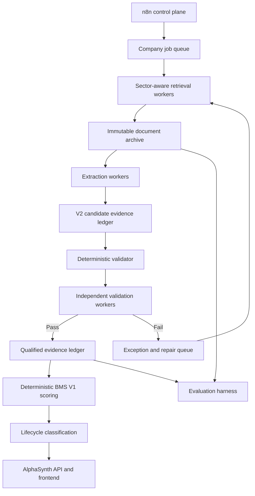

# AlphaSynth BMS V2 Evidence Integrity and Implementation Plan

**Document status:** Proposed design and audit baseline
**Purpose:** Preserve the conclusions of the BMS evidence-contract audit and define the implementation, evaluation, and rollout plan for BMS V2.
**Important boundary:** BMS V2 in this document means an upgrade to evidence ingestion, provenance, validation, and auditability. It does **not** change the frozen BMS V1 four-factor scoring formula, factor weights, signal date, or lifecycle rules unless a separate methodology change is reviewed and approved.

## 1. Executive decision

The current extraction approach is promising: a small manual audit found exact agreement between selected extracted figures and their official sources. The current production gate also blocks companies that do not contain all four required factors.

The present evidence contract is nevertheless a reduced form of the architecture originally specified. It cannot systematically prove:

- that previous and current values share the same consolidation basis;
- that the compared periods are mechanically comparable;
- that unit normalization was correct;
- that a score can be reproduced from the exact immutable source documents; or
- that producer confidence was independently validated.

The recommended decision is therefore:

1. Build and freeze a versioned V2 evidence contract.
2. Prove it on at least five diversified companies.
3. Migrate and revalidate the existing 50-company cohort.
4. Run source-to-app evaluations throughout the migration.
5. Expand toward 477 only after the V2 gate passes.
6. Process the wider universe in controlled batches with automatic validation and manual sampling.

No unavailable value should be estimated merely to increase the published-company count.

## 2. Current system: what is already valuable

The existing pipeline already provides meaningful safeguards:

- four mandatory score-bearing factors;
- previous and current observations;
- metric-to-factor taxonomy checks;
- source URLs and source dates;
- evidence cutoff enforcement;
- non-empty units and period labels;
- numeric-value and confidence checks;
- official/trusted source-type restrictions;
- evidence-completeness and publication-eligibility gates; and
- exclusion of incomplete companies from the published shortlist.

These controls and the existing 50-company work should be preserved. V2 should migrate and strengthen the evidence base, not discard it without cause.

## 3. Audit findings and disposition

| Audit issue | Present state | V2 disposition | Priority |
|---|---|---|---|
| Company, factor, and metric identifiers | Present under renamed fields | Preserve canonical IDs and explicit aliases | Required |
| Previous/current values | Present | Preserve raw and canonical forms | Required |
| Previous/current source references | Present as split URLs in the canonical CSV | Replace URL-only identity with durable document IDs while retaining URLs | Required |
| Source date and cutoff date | Present | Preserve and validate | Required |
| Producer confidence | Present as generic `confidence` | Split producer confidence from validator decision/confidence | High |
| Consolidation basis | Missing | Add controlled `consolidated`, `standalone`, `not_applicable`, or `unknown` value; `unknown` cannot qualify a basis-sensitive comparison | Critical |
| Comparison basis | Inferred from labels | Store a controlled value and validate it against actual dates and durations | Critical |
| Previous/current period-end dates | Missing | Make both dates mandatory for score-bearing evidence | Critical |
| Raw and canonical units | Collapsed into one field | Preserve raw value/unit and canonical value/unit plus conversion metadata | Critical |
| Archive URI and SHA-256 | Generated by document acquisition but left in sidecar audits | Promote to the durable document/evidence ledger | Critical |
| Run, producer, method, page, capture time | Missing from the score-bearing ledger | Add for orchestration, debugging, replay, and audit | High |
| Independent validator result | Not a separate durable field | Store validator identity, version, status, confidence, and reasons | Critical |

## 4. Why these fields matter

### 4.1 Consolidation basis

Standalone and consolidated accounts can contain materially different revenue, profit, debt, assets, and margins. Comparing one basis with another can create a false positive or false negative momentum signal even when both source numbers were copied correctly.

### 4.2 Comparison basis and actual dates

Human-readable labels such as `Q3 FY25` do not prove that two observations have identical duration or fiscal treatment. V2 must distinguish same-quarter-prior-year, sequential-quarter, year-to-date, half-year, annual, point-in-time, and other permitted comparisons.

### 4.3 Raw and canonical units

The evidence ledger must show both what the issuer reported and what the scoring engine consumed. This prevents silent errors involving rupees, lakhs, crores, millions, percentages, ratios, and basis points.

### 4.4 Immutable document provenance

URLs can expire, change, redirect, or return a revised document. A SHA-256 hash and archive URI identify the precise source used for the score and permit later reproduction even when the public link stops working.

### 4.5 Independent validation

An extraction agent's confidence is not an independent quality conclusion. Producer confidence, deterministic validation, and independent semantic validation must remain separate.

## 5. V2 evidence contract

The exact physical representation may use normalized database tables rather than one wide CSV. The logical contract must cover the following fields.

### 5.1 Run and company identity

- `schema_version`
- `run_id`
- `company_id`
- `company_symbol`
- `company_name`
- `sector_profile_id`
- `information_cutoff`

### 5.2 Factor and metric identity

- `factor_id`
- `canonical_metric_id`
- `source_metric_label`
- `metric_definition_version`

### 5.3 Period identity

- `previous_period_label`
- `current_period_label`
- `previous_period_start_date` where relevant
- `previous_period_end_date`
- `current_period_start_date` where relevant
- `current_period_end_date`
- `comparison_basis`
- `consolidation_basis`

### 5.4 Values and normalization

- `previous_raw_value`
- `current_raw_value`
- `raw_unit`
- `previous_canonical_value`
- `current_canonical_value`
- `canonical_unit`
- `conversion_rule_id`
- `calculated_change`
- `change_unit`

### 5.5 Document provenance

- `previous_document_id`
- `current_document_id`
- original and resolved source URLs
- archive URIs
- SHA-256 hashes
- source types and tiers
- source publication dates
- source page/table/section references
- document capture time

### 5.6 Production and validation

- `extraction_method`
- `extractor_version`
- `producer_agent_id`
- `producer_confidence`
- `deterministic_validation_status`
- `independent_validator_id`
- `validator_version`
- `validator_status`
- `validator_confidence`
- structured validation/rejection reasons
- `publication_status`
- timestamps for creation, validation, qualification, and supersession

## 6. Storage model

CSV may continue as an import/export and audit format, but should not remain the canonical operational database.

Recommended ledgers:

1. **Document ledger:** one immutable row per downloaded document/hash.
2. **Candidate evidence ledger:** all extracted observations, including rejected and pending rows.
3. **Qualified evidence ledger:** only evidence that passed the V2 validation sequence.
4. **Exception ledger:** structured failures, ownership, retry history, and resolution.
5. **Score ledger:** deterministic BMS inputs, weights, score contributions, score, and lifecycle output.

No producer or orchestration workflow may write directly into the qualified or score ledger.

## 7. Source hierarchy

### Tier 1: authoritative score-bearing sources

- company investor-relations filings and result documents;
- NSE filings;
- BSE filings;
- audited financial statements and annual reports;
- official earnings releases and investor presentations;
- SEBI, RBI, and other applicable regulator sources; and
- official conference-call transcripts where available.

The system should not depend only on NSE. Issuer, NSE, BSE, and regulator sources provide redundancy when one site blocks retrieval or does not contain the required operational metric.

### Tier 2: official supporting sources

- official press releases;
- official operating updates;
- official management transcripts;
- government releases; and
- recognized rating documents when their use is clearly identified.

### Tier 3: discovery, reconciliation, and market context

- Screener;
- Moneycontrol;
- Yahoo Finance; and
- other secondary financial portals.

These sources may help locate a primary filing, identify a possible anomaly, or provide market-price context. They should not normally be the final score-bearing source for execution or balance-sheet evidence. Under V2, a secondary source may create a candidate or exception, but qualification should require an official, exchange, regulator, or audited anchor.

Yahoo Finance or an equivalent market-data service may be used for price and return context. Market prices are not substitutes for fundamental BMS factor evidence.

## 8. Acquisition fallback sequence

When an official document is not immediately retrievable:

1. Search the issuer investor-relations site.
2. Search both NSE and BSE.
3. Check the immutable archive for an existing hash/document.
4. Check regulator or recognized official repositories.
5. Use secondary portals for discovery of the original filing, not as silent substitutes.
6. Route unresolved cases to the exception queue.
7. Leave the observation unavailable if it cannot be verified.

A larger language model cannot reliably solve a missing document, HTTP 403, deleted link, or ambiguous accounting basis. Retrieval redundancy, archival, and validation solve those problems; AI assists with interpretation after acquisition.

## 9. Technology stack

### Product and API

- React and TypeScript frontend
- Node.js and TypeScript AlphaSynth API/proxy
- Python and FastAPI BMS/evidence services
- Google Cloud Run deployment

### Durable data and workflow

- PostgreSQL/Cloud SQL for document, candidate, qualified, exception, and score ledgers
- Google Cloud Storage for immutable source documents and extracted text
- SHA-256 document identity
- Pub/Sub or Cloud Tasks for bounded asynchronous work
- n8n as scheduler, control plane, and operational workflow coordinator

### Extraction and validation

- Gemini or another approved document-understanding model for structured candidate extraction
- deterministic Python/TypeScript validation for dates, arithmetic, units, taxonomy, weights, and lifecycle computation
- independent semantic validation for consolidation, comparability, contradictions, and source meaning
- exception-resolution workers for ambiguous or failed cases

### Quality and operations

- versioned evaluation harness and golden-company fixtures
- GitHub version control and CI checks
- Google Cloud Logging and structured run diagnostics
- batch dashboards showing monitored, candidate, qualified, rejected, and pending counts

## 10. Multi-agent structure

The recommended system is hybrid: task-specialist workers share a common harness and apply versioned sector profiles.

### 10.1 Sector-aware profiles

Examples include:

- banks/NBFCs: NIM, asset quality, AUM, capital adequacy;
- industrials: order intake, order book, execution, working capital;
- IT services: deal TCV, utilization, attrition, margin;
- pharmaceuticals: launches, regulatory status, R&D, geography mix; and
- commodities: volume, realization, cost, capacity, leverage.

The objective is not one permanent autonomous agent per company. A pool of common workers processes company jobs with the appropriate sector profile.

## 11. Role of n8n

n8n is the conductor, not the financial-data or scoring engine.

It should:

- start scheduled and manual runs;
- load the controlled company universe;
- split the universe into bounded batches;
- submit jobs to Pub/Sub or Cloud Tasks;
- fan out retrieval/extraction sub-workflows;
- enforce concurrency and rate limits;
- monitor checkpoints, timeouts, and retries;
- route failures to the exception queue;
- trigger validation after candidate extraction;
- trigger scoring only after qualification; and
- publish operational summaries and human-review notifications.

It should not:

- store the canonical evidence ledger;
- perform financial calculations in workflow expressions;
- decide period comparability or consolidation consistency;
- contain the BMS scoring methodology; or
- carry the entire 477-company universe through one large linear payload.

Although n8n workflows are visually sequential, they can initiate asynchronous jobs, parallel sub-workflows, and fan-out/fan-in operations. Durable job state must live in the database/queue so that n8n executions can restart without losing or duplicating work.

## 12. Validator sequence

Every candidate should pass the following ordered checks:

1. schema/version validity;
2. company, factor, and metric identity;
3. source-tier eligibility;
4. cutoff-date compliance;
5. document hash/archive integrity;
6. period-date and duration comparability;
7. comparison-basis validity;
8. consolidation-basis consistency;
9. raw/canonical unit and conversion validity;
10. numeric extraction and arithmetic checks;
11. metric-to-factor mapping;
12. contradiction/cross-source checks;
13. independent semantic validation;
14. four-factor publication eligibility; and
15. deterministic BMS scoring and lifecycle classification.

The pipeline must never turn absence into a neutral value.

## 13. Evaluation programme

Financial fields should use an exact-match/reconciliation standard. An average model accuracy percentage is not sufficient for score-bearing evidence.

| Gate | Automated scope | Manual source-to-app evaluation | Required outcome |
|---|---:|---:|---|
| Contract fixtures | Deliberate pass/fail cases | At least 5 | Every deliberate failure is caught |
| Initial V2 pilot | 5 diversified companies | All 5 | Exact values, units, dates, bases, and source hashes |
| Integration cohort | 10 diversified companies | At least 5 | No critical mismatch and reproducible score |
| Existing cohort | All 50 companies | At least 10 | All published companies pass V2; failures quarantined |
| Expansion batches | Every company in each 25-50 batch | At least 5 per batch | Zero critical sampled mismatches |
| Final universe | All qualified companies | Risk-based sample plus all exceptions | Reproducible evidence-to-lifecycle chain |
| Continuing operation | Every reporting cycle | Rotating sample of at least 5 | No silent source/schema drift |

### 13.1 What an evaluation must reconcile

- exact source document and SHA-256 hash;
- source page/table/section;
- raw previous/current values and units;
- canonical values and conversion rule;
- fiscal labels and actual dates;
- comparison and consolidation bases;
- direction of change;
- factor classification and weight;
- BMS contribution, total score, and lifecycle; and
- evidence displayed by the frontend.

### 13.2 Stop conditions

A batch should stop for investigation when a sampled or automated check finds:

- an incorrect financial value;
- a consolidation mismatch;
- a non-comparable period pair;
- an unexplained unit conversion;
- a source/hash mismatch;
- post-cutoff evidence;
- scoring from rejected/unqualified evidence; or
- disagreement between the score ledger and frontend.

The failure class must be corrected in the shared harness before the batch is resumed. Company-specific hard-coding should be a last resort and must be documented.

## 14. Migration of the existing 50-company cohort

The existing evidence should be treated as legacy candidate evidence until it passes V2—not presumed wrong and not presumed fully V2-qualified.

Recommended migration:

1. Register existing archived documents in the document ledger.
2. Reconcile sidecar audit hashes and archive paths with evidence rows.
3. Backfill publication/capture dates and source metadata.
4. Re-extract or reconstruct actual period dates, consolidation basis, and raw units where absent.
5. Normalize values under versioned conversion rules.
6. Run deterministic and independent validation.
7. Recompute the same frozen BMS V1 formula from the qualified ledger.
8. Compare the new result with the existing score/lifecycle and investigate every difference.
9. Manually audit at least 10 diversified companies before accepting the cohort.

Existing archive material should reduce redownload and model cost, but some documents will require renewed interpretation.

## 15. Implementation phases and time estimate

The following estimates are working-day ranges, not guarantees. They assume access to the present repository and cloud configuration, reuse of current acquisition/extraction code, and parallel work only after the shared contract is frozen.

| Phase | Principal work | Estimate |
|---|---|---:|
| 0. Design freeze | Confirm fields, enums, source policy, acceptance criteria, and migration rules | 1-2 days |
| 1. Storage and schema | Database migrations, document/candidate/qualified/exception ledgers, schema versioning | 3-5 days |
| 2. Acquisition provenance | Document registration, hashes, archive URIs, source resolution, page/section metadata | 3-5 days |
| 3. Producer/importer upgrade | V2 structured output, backward-compatible import, sector profiles, idempotency | 4-7 days |
| 4. Deterministic validator | Dates, bases, units, taxonomy, cutoff, arithmetic, document integrity | 4-6 days |
| 5. Independent validation and exception flow | Semantic checks, contradiction handling, retry/repair contracts | 3-5 days |
| 6. Evaluation harness | Golden fixtures, deliberate failure cases, source-to-app reconciliation reports | 3-5 days |
| 7. Five-company proof | Full run and manual 5/5 verification | 2-3 days |
| 8. Existing 50 migration | Backfill, revalidation, discrepancy analysis, manual 10-company audit | 4-8 days |
| 9. Production integration | n8n/queues, observability, UI status distinctions, deployment rehearsal | 3-5 days |

Some phases overlap after the V2 contract is frozen. A realistic expectation is:

- **V2 foundation plus five-company proof:** approximately 3-4 calendar weeks.
- **V2-qualified 50-company cohort:** approximately 4-6 calendar weeks from commencement.
- **Controlled expansion through 477:** an additional 2-4 calendar weeks, depending primarily on source accessibility and exception rates.
- **Prudent end-to-end range:** approximately 6-10 calendar weeks.

An accelerated path might complete the V2-qualified 50 in about 3 weeks, but it would require stable source access, limited migration surprises, and disciplined parallel execution. It should not be used as a credibility promise.

Multi-agent execution reduces document-retrieval and extraction elapsed time. It does not safely compress schema decisions, validator correctness, migration reconciliation, or human financial-data evaluations to the same degree.

## 16. Milestones and approval points

No later phase should begin automatically.

1. **M0 — Contract approval:** schema, enums, source hierarchy, and evaluation policy approved.
2. **M1 — Storage approval:** document and evidence ledgers demonstrated.
3. **M2 — Validator approval:** deliberate failure fixtures pass.
4. **M3 — Five-company approval:** 5/5 manual reconciliation complete.
5. **M4 — Fifty-company approval:** automated cohort plus manual 10-company audit complete.
6. **M5 — Expansion approval:** batch size, concurrency, cost limits, and stop conditions approved.
7. **M6 — 477-company completion:** qualified/rejected/pending counts and audit pack accepted.

## 17. Definition of done

BMS V2 evidence integrity is complete when:

- every published factor is traceable to immutable source documents;
- period and consolidation comparability are mechanically validated;
- raw and canonical values/units are reproducible;
- producer and validator conclusions are separate;
- only qualified evidence can enter deterministic scoring;
- the frontend can reproduce the score ledger without hidden inference;
- the 50-company cohort passes automated V2 validation and the agreed manual audit;
- batch expansion has explicit stop conditions and resumable checkpoints; and
- the system reports monitored, candidate, qualified, rejected, and pending companies truthfully.

## 18. Governance principles

- Accuracy and reproducibility take precedence over headline coverage.
- The monitored universe and qualified published universe must be reported separately.
- Missing evidence must remain unavailable rather than inferred as neutral.
- AI may propose evidence; deterministic and independent controls decide qualification.
- Every methodology, mapping, conversion, and validator change must be versioned.
- Frozen BMS V1 scores and historical observations must not be silently rewritten.
- Any future change to factors, weights, scoring, or lifecycle thresholds requires a separate methodology review.
