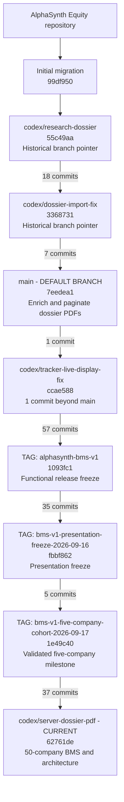

# AlphaSynth GitHub Branch Structure

**Repository:** `srscoll-lab/alphasynth-equity`

**Structure captured:** 18 September 2026

**Default GitHub branch:** `main`

**Current development branch:** `codex/server-dossier-pdf`

## 1. Executive summary

The repository currently has five remote branch references, but they do not represent five competing versions of AlphaSynth. They form an almost entirely linear development history. Each older branch tip is already an ancestor of the current development branch.

The practical structure is:

1. The original research-dossier work established the evidence-dossier foundation.
2. The dossier-import branch improved document-date admission.
3. Those changes progressed into `main`.
4. The tracker-live branch added one subsequent repair.
5. The active `codex/server-dossier-pdf` branch then accumulated the BMS V1, evidence qualification, cohort expansion, report, carousel and architecture work.

The important operational fact is that `codex/server-dossier-pdf` is currently **135 commits ahead of `main`**. Therefore, GitHub's default `main` branch does not yet represent the latest AlphaSynth product state.

## 2. Branch and release map



## 3. Current remote branches

### 3.1 `main`

- **Commit:** `7eedea1`
- **GitHub role:** Default branch.
- **Tip description:** Enrich and paginate dossier PDFs.
- **Relationship:** Ancestor of the active development branch.
- **Current limitation:** It is 135 commits behind `codex/server-dossier-pdf` and therefore does not include the latest BMS product work.

### 3.2 `codex/server-dossier-pdf`

- **Commit:** `62761de`
- **Role:** Active and most advanced development branch.
- **Relationship:** Contains every other presently listed remote branch tip in its ancestry.
- **Major work represented:**
  - Server-generated dossier PDFs.
  - BMS factor measurement and evidence qualification.
  - Four-factor publication controls.
  - Five-company, 25-company and 50-company cohort work.
  - Evidence recovery, provenance and official-document ingestion.
  - Signal evidence workspace and report presentation.
  - Carousel and product walkthrough refinements.
  - Multi-agent ingestion architecture documentation.
- **Next Git decision:** Review and merge into `main` when the release candidate is accepted.

### 3.3 `codex/tracker-live-display-fix`

- **Commit:** `ccae588`
- **Role:** Historical repair branch for the live BMS forward tracker.
- **Relationship:** One commit ahead of `main`, but already fully contained in `codex/server-dossier-pdf`.
- **Action required:** No separate reintegration is needed if the current development branch is merged.

### 3.4 `codex/dossier-import-fix`

- **Commit:** `3368731`
- **Role:** Historical document-import correction branch.
- **Tip description:** Admit unambiguous document title dates.
- **Relationship:** Seven commits behind `main` and already contained in both `main` and the current development branch.
- **Action required:** No separate merge is required.

### 3.5 `codex/research-dossier`

- **Commit:** `55c49aa`
- **Role:** Historical foundation branch for the official-evidence dossier orchestrator.
- **Relationship:** Twenty-five commits behind `main` and already contained in the later branches.
- **Action required:** No separate merge is required.

## 4. Release tags

Tags are permanent names attached to specific commits. Unlike branches, they do not move when new commits are added.

### 4.1 `alphasynth-bms-v1`

- **Commit:** `1093fc1`
- **Date:** 12 September 2026.
- **Meaning:** Functional AlphaSynth BMS V1 release freeze.
- **Position:** 57 commits after the tracker-live repair and 75 commits before the current branch tip.

### 4.2 `bms-v1-presentation-freeze-2026-09-16`

- **Commit:** `fbbf862`
- **Date:** 16 September 2026.
- **Meaning:** Presentation-oriented BMS V1 freeze.
- **Position:** 35 commits after the functional V1 tag.

### 4.3 `bms-v1-five-company-cohort-2026-09-17`

- **Commit:** `1e49c40`
- **Date:** 17 September 2026.
- **Meaning:** Validated five-company evidence-cohort milestone.
- **Position:** Five commits after the presentation freeze and 37 commits before the current branch tip.

## 5. Commit-distance view

```text
codex/research-dossier
        |
        | 18 commits
        v
codex/dossier-import-fix
        |
        | 7 commits
        v
main
        |
        | 1 commit
        v
codex/tracker-live-display-fix
        |
        | 57 commits
        v
tag: alphasynth-bms-v1
        |
        | 35 commits
        v
tag: bms-v1-presentation-freeze-2026-09-16
        |
        | 5 commits
        v
tag: bms-v1-five-company-cohort-2026-09-17
        |
        | 37 commits
        v
codex/server-dossier-pdf
```

## 6. What is merged and what is not

### Already incorporated into the current development branch

- Research-dossier orchestration.
- Dossier-import fixes.
- Everything currently on `main`.
- The tracker live-display repair.
- Every tagged BMS V1 milestone.

### Not yet incorporated into `main`

- The 135 commits after `main`, including the active BMS V1 evidence and cohort work.
- The latest 50-company publication state.
- The newest evidence-report labeling corrections.
- The multi-agent ingestion architecture document.

## 7. Recommended branch policy from this point

1. Treat `codex/server-dossier-pdf` as the release-candidate branch until the current BMS V1 acceptance checks are complete.
2. Avoid adding unrelated experimental work to the release-candidate branch.
3. Run the final build, tests, publication audit and pilot verification from the exact branch tip proposed for merging.
4. Open a pull request from `codex/server-dossier-pdf` into `main`.
5. Review the 135-commit delta by functional area rather than attempting a single undifferentiated review.
6. Merge only after the deployed candidate and the reviewed commit are proven to be identical.
7. Create a final release tag after the merge or at the exact accepted release commit.
8. Archive or delete obsolete remote branches only after verifying that their tips are reachable from the accepted release.

## 8. Suggested functional review groups before merging

The 135 commits should be reviewed in coherent groups:

1. **Dossier and PDF generation** - server PDF generation, charts, date handling and completeness controls.
2. **BMS methodology** - four-factor scoring, evidence qualification, display scaling and lifecycle classification.
3. **Evidence ingestion** - official-document discovery, extraction, provenance, normalization and fallbacks.
4. **Cohort rollout** - stop-line cohort, five-company cohort, controlled 25 and expanded 50-company cohort.
5. **User experience** - signal evidence workspace, factor explanations, labels, colors and conflicting-metric presentation.
6. **Supporting product assets** - carousel, samples and walkthrough materials that are intended to remain in the repository.
7. **Documentation** - operating procedures, audit scripts and the multi-agent ingestion architecture.

## 9. Practical conclusion

The repository is not suffering from several incompatible active branches. It has one dominant development line whose latest work has not yet been merged into the default branch.

The immediate objective should therefore be to stabilize and review `codex/server-dossier-pdf`, merge it into `main`, and establish a shorter-lived branch discipline for the next development phase.
